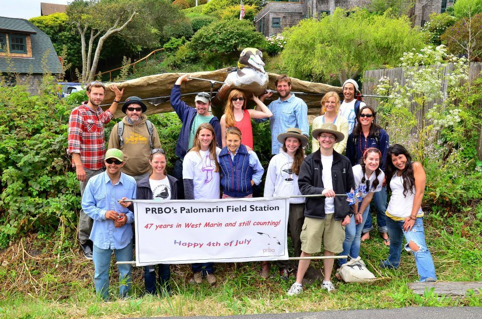
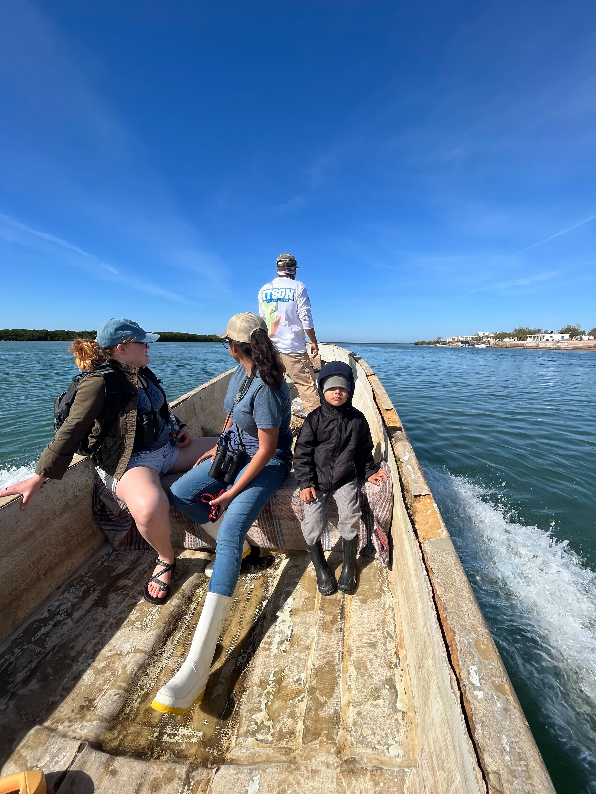

```{r setup, include=FALSE}
knitr::opts_chunk$set(echo = TRUE)
```

```{css float-right-figure-caption, echo = FALSE}
.my-right-figure {
  display: table;
  float: right;
  padding-left: 30px;
  padding-bottom: 10px;
}
.my-right-figure p + p{
  display: table-caption;
  caption-side: bottom;
  padding-left: 30px
}
.figure {
  display: contents;
}
```

```{css float-left-figure-caption, echo = FALSE}
.my-left-figure {
  display: table;
  float: left;
  padding-right: 30px;
  padding-bottom: 10px;
}
.my-left-figure p {
  display: table-caption;
  caption-side: bottom;
  padding-right: 30px
}
.figure {
  display: contents;
}
```

I spent last 4th of July volunteering at Intermountain Bird Obseratory’s [Lucky Peak Research Station](https://www.boisestate.edu/ibo/science/lucky/). Like many volunteer corps, we were a mix of undergrads hungry for experience, grad students with even less sense than freetime, and retirees. Throw in curious visitors and a few rambunctious kids and the atmosphere wasn’t that different from a community cookout. However, we were contributing to a rigorous, decades-long dataset that informs land management. Bird observatories are a fascinating human-environment system at the intersection of science and community engagement and an underappreciated source of social data. In addition, social science research fits within the conservation goals of many bird observatories. More social scientists should be paying attention to bird observatories, and more bird observatories should be doing social science.



## Bird observatories as social observatories

The first bird observatories focused on long-term ecological monitoring of migratory birds. The goal of long-term monitoring is to track populations over time. Its value comes from the steady accumulation of data year after year.  Aside from the many important benefits of long-term monitoring to science, the nature of the work leads to a consistent presence on the landscape. This creates different opportunities for collaboration and conflict compared to research centered around university funding-cycles. How does this impact the way people living near bird observatories view scientists and the scientific process? What does that mean for their outlook towards conservation? Community members that engage with bird observatories are just one group worthy of social scientists’ attention. Bird observatories rely on seasonal labor to do their research. Many are located in rural areas, in communities familiar with migratory workforces. How does the ebb and flow of migratory field ecologists impact rural communities, and how does that compare with the impacts from other industries like agriculture or resource extraction? 

## ... And bird observatories need social science!

Bird observatories are paying attention to social scientists focused on diversity, equity, and inclusion, and environmental justice. Major organizations like Point Blue Conservation Science or National Audubon Society (not a bird observatory but another organization worthy of attention by social scientists) are hiring social scientists and DEI managers. This is important work that must continue. However, these are not the only things social scientists have to teach ecologists about human systems. Designing research utilizing the unique perspective of bird observatories  in research and conservation should be a priority for social scientists and ecologists. 



Bird observatories focus on documenting and understanding changes in bird populations and distribution in order to put the best information in the hands of decision makers. Expanding their research focus to include more social science fits within this research tradition. Observatories have always adopted the best available technology in pursuit of their research goals. For example, when I began working at bird observatories in the early 2010’s, my early mentors were delighted that GPS tracking devices used to study animal movement shrunk to the point they could be placed on small songbirds. They could finally answer long-standing questions like “where do our birds go?”. Precise location data for birds along their migratory routes opens up new questions about interactions between birds and people living along these routes. Bird observatories can fill these gaps by reaching out to social scientists and design studies focusing on how conservation can be done better in specific migratory networks. Academic ecologists often take advantage of the infrastructure of long-term bird banding stations to address a specific research question that can be studied after bird observatories collect their demographic data. This model also works for social science. Many of these banding stations are open to the public. Would it take much more effort for banding stations to collect data from these visitors? These are just some examples of the way bird observatories can work to get the most out of their study systems in order to understand the complex interactions that influence bird conservation. 


