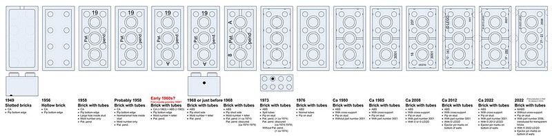
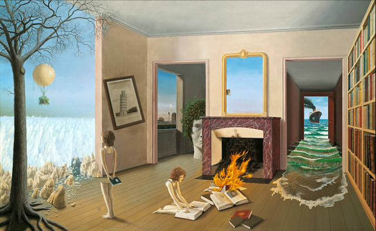

```{r setup, include=FALSE}
knitr::opts_chunk$set(echo = TRUE)
```

```{css float-right-figure-caption, echo = FALSE}
.my-right-figure {
  display: table;
  float: right;
  padding-left: 30px;
  padding-bottom: 10px;
}
.my-right-figure p + p{
  display: table-caption;
  caption-side: bottom;
  padding-left: 30px
}
.figure {
  display: contents;
}
```

```{css float-left-figure-caption, echo = FALSE}
.my-left-figure {
  display: table;
  float: left;
  padding-right: 30px;
  padding-bottom: 10px;
}
.my-left-figure p {
  display: table-caption;
  caption-side: bottom;
  padding-right: 30px
}
.figure {
  display: contents;
}
```


About twenty years ago, a mentor recommended B.K. Forscher's 1963 essay [Chaos in the Brickyard](https://www.science.org/doi/10.1126/science.142.3590.339.a) as I was thinking about what it meant to be a graduate student. Since then, I've probably read it another 15 times. Sure, the language is a bit dated, but I think the general concern that scientists (especially new scientists) have become overly focused on "bricks" and not "structures" is an important one - and one that seems more relevant today than it might have 60 years ago. We actually named the student publication for the [UC Davis Graduate Group in Ecology](https://ecology.ucdavis.edu/) the [Aggie Brickyard](https://aggiebrickyard.github.io/) as a nod to the ideas and concerns that Forscher raises. I recently came across a [substack article by Kevin Munger](https://kevinmunger.substack.com/p/generalizing-knowledge-of-twitter) where he uses a similar analogy to describe the "folk theorem" of science wherein a community of scholars conduct studies that build on the work of previous scholars and respond to various questions/debates within a discipline. Knowledge, so the idea goes, grows as a function of the number and quality of studies ("bricks") accumulate. Forscher, Munger, and many others have highlighted the fact that simply accumulating bricks doesn't actually result in a house (or other structure). 

> “Science is built of facts the way a house is built of bricks: but an accumulation of facts is no more science than a pile of bricks is a house” --Henri Poincaré

But bricks are only useful in service of some larger, well-designed structure and that the mark of a good scientist is their ability to design elegant structures - not just produce bricks. This need to design elegant structures, to me, is a call for interdisciplinarity. A well-organized set of bricks may provide the walls of a house, but that's still no way to live. We need cabinets and countertops to store the pieces that make the house useable, we need furniture to help distinguish one room from the other, we need plumbing and electrical wires to connect the parts of the house to itself and to the larger city. These things things cannot be made of bricks (unless you are building a house of Legos).




 
The point here is that if science is to actually contribute to elegant, useable structures; we need the knowledge, tools, and products produced by many different ways of knowing (whether those be disciplinary, cosmological, etc). While we still need scientists to continue refining their approach to brick-making (or furniture upholstery, or cabinetry), the real challenge is in organizing all of these things into a home that is liveable. Even when projects are designed to be multi-disciplinary, they still require someone (or some group intention) to think about how all the pieces fit and how to stage the project so that you don't end up with some surrealist version of a structure. This is the role for an [interdisciplinary scientist](https://www.science.org/content/article/changes-world-science-realities-interdisciplinary-training).

{ style="float: left; padding: 10px"}

As science struggles to remain relevant to societal challenges, it's no longer enough to simply build a house and hope that someone will inhabit it. There's an actual client! One that has needs from the structure we are building and who has to make decisions about whether the investment is worth it. Our job is not to convince them that the house we've built is great (i.e., translate our work into something they appreciate), that's the job of a realtor. Our job is to engage in open dialogue to understand their needs and work together to design and build the structure that meets those needs. We are architects, general contractors, and collaborators - not just brick-makers. 
