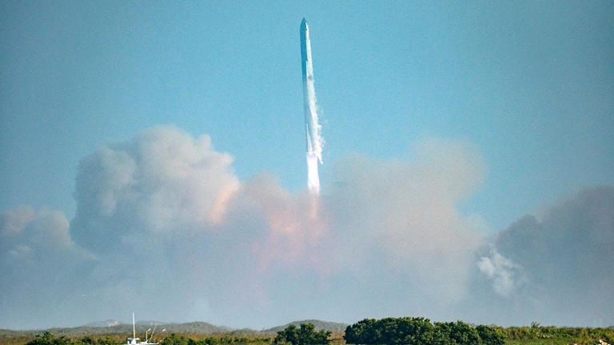

```{r setup, include=FALSE}
knitr::opts_chunk$set(echo = TRUE)
```

```{css float-right-figure-caption, echo = FALSE}
.my-right-figure {
  display: table;
  float: right;
  padding-left: 30px;
  padding-bottom: 10px;
}
.my-right-figure p + p{
  display: table-caption;
  caption-side: bottom;
  padding-left: 30px
}
.figure {
  display: contents;
}
```

```{css float-left-figure-caption, echo = FALSE}
.my-left-figure {
  display: table;
  float: left;
  padding-right: 30px;
  padding-bottom: 10px;
}
.my-left-figure p {
  display: table-caption;
  caption-side: bottom;
  padding-right: 30px
}
.figure {
  display: contents;
}
```

## What are we doing here?

<div style="float: right; margin: 10px; width: 300px;">
  
  <p style="font-size: 0.9em; text-align: center;">One of the strangest things I've ever seen, in one of the strangest places I've ever been, during one of the strangest times I've ever lived through. Also, it was hot. Photo &copy;Sergio Flores</p>
</div>

I just got back from my first visit to the Gulf Coastal Plains of Texas and have been thinking a lot about how the landscapes we know (and love) shape the questions we seek out. Or maybe, more accurately, how they impact what insights are possible. For example, as a PhD student in California, I was often struck (annoyed?) by how many folks refused to work outside of the western United States. As someone has lived in 11 different states and found things to love (and hate) about all of those places, I couldn't really understand this "regionalism". Or maybe, more accurately, I couldn't really understand why they were so convinced that other places were awful (even if they had more biodiversity, deciduous trees, better food, nicer people, etc). I've spent a lot of time enjoying my moral high ground of being geographically curious.

But south Texas? Let's be serious. As a kid from Louisiana, I was pretty convinced that there was very little in Texas that I wanted (except for ice skating in malls and Space Camp). The years hadn't really softened my marginally informed contempt for Texas. 

## Why I thought it would be interesting?

## What's a cool anecdote that makes this fun?


## What did I learn?

