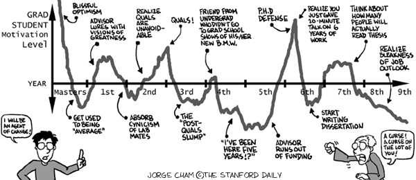

```{r setup, include=FALSE}
knitr::opts_chunk$set(echo = TRUE)
```

```{css float-right-figure-caption, echo = FALSE}
.my-right-figure {
  display: table;
  float: right;
  padding-left: 30px;
  padding-bottom: 10px;
}
.my-right-figure p + p{
  display: table-caption;
  caption-side: bottom;
  padding-left: 30px
}
.figure {
  display: contents;
}
```

```{css float-left-figure-caption, echo = FALSE}
.my-left-figure {
  display: table;
  float: left;
  padding-right: 30px;
  padding-bottom: 10px;
}
.my-left-figure p {
  display: table-caption;
  caption-side: bottom;
  padding-right: 30px
}
.figure {
  display: contents;
}
```


## What is a PhD program? What is it not?

A PhD is a doctor of philosophy, even if your area of expertise is biophysical sciences, social sciences, liberal arts, etc. Philosophy means “love of wisdom.” What is wisdom and what does it mean to be wise? Well… those are big questions that we can’t answer for you. But we can say that a PhD program will challenge you to think about who you are, what constitutes knowledge, what are the “best” or “right” ways to develop that knowledge, and to what end. A PhD program is an opportunity to expand your thinking beyond what you know to be possible. The focus is on asking questions, sometimes getting answers, and almost always getting more questions (this process is also known as research). Having a love of wisdom (and a comfort level with ambiguity) is pretty essential for embarking on this journey.

A PhD program is NOT a project, a mentorship program, or any other program designed to teach you  how to teach, manage projects, or navigate challenging interpersonal dynamics. You may get aspects of these things in a PhD, but they are not the focus and they are not guaranteed. For example, you will likely work on a project or projects during your PhD, but the focus isn’t finishing the project, the focus is asking questions that the project may help answer. You will have an advisor during your PhD (notice that they are not called a mentor) and the extent to which they actually mentor you depends very much on who they are and what you explicitly ask of them. There is very little institutional support for structuring how advisors interact with their students and advisors are typically trained in research, not teaching/mentorship. Unless they are naturally good at teaching/mentorship and/or actively work on improving on their own initiative (often at a cost to their research agenda), they are working from a pretty unsupported and uninformed place with respect to mentorship (not research). And finally, you may get opportunities to teach, manage projects, and navigate interpersonal dynamics, but the focus of your PhD program is not about providing those opportunities (though most PhD programs do incidentally provide them and you might not think of them as opportunities in the moment, lol).

Many incoming PhD students do not appreciate this distinction at the outset of their degree, which makes it hard to know what is reasonable to expect out of themselves and the program. To the extent that you can, designing your program and seeking out opportunities with your career goals in mind can be really helpful. For example, if you're really interested in teaching undergraduates at a small liberal arts college, you should pursue as many teaching opportunities during your PhD as you can and find formal training programs wherever they exist. On the other hand, if a research job is the vision, meaningfully contributing to a variety of projects that grow your research experience and agenda should be the priority. Articulating your career goals to your advisor and asking for what you need to achieve those goals will be helpful. Of course, it can be hard to know what to ask for and your vision for the future may change through the course of graduate school!

## What are the “right reasons” for getting a PhD?

There are all sorts of motivations and nobody can really tell you what the right reasons for getting a PhD are, but we have found that curiosity and a desire to learn are pretty essential for happiness and motivation over the lifespan of a PhD program, which is long! Keep in mind that you don’t have to know exactly what you want to learn, because this will likely change or develop as you spend more time in your program.

The only wrong reason to get a PhD is to not have a reason at all. Entering into a PhD (or any other graduate program) should be a deliberate, intentional choice – never the default. If you're not sure a PhD is what you want, seek out experiences that may help you make that decision. It's well worth your time to do some real self-reflection on your motivations before diving into a program that may not be a good fit for you.



## What questions should you ask yourself before you start a PhD program?

This list is by no means complete, but here are some questions we have found helpful as you consider a PhD program:

*What am I interested in? What questions about the world do I have? How do I want to answer these questions? What fundamental goal drives this curiosity?*

You don’t have to have answers to these questions – just asking them and having a sense of the direction you are going is a great starting point. Also, asking them and observing how you react to your answers or the ambiguity of your answers will tell you something about how a PhD will make you feel at times (maybe excited, uncomfortable, confused, curious, inspired, incisive, etc.).

*What do I want to get out of a PhD program?*

Are there specific knowledge, content areas, or skills that you seek? A PhD program typically provides knowledge and skills in philosophy, theory, and methods. Evaluating the extent to which the program you are considering is strong in those areas will be important. Teaching opportunities will likely be available, but as we said before, they are not a given so you need to articulate the extent to which you want to teach / learn to teach.

Practical skills that are transferable to non-academic jobs (e.g., grant writing, budgeting, project management) are ones you are not necessarily going to get in academia unless you specifically seek them out (even though they are also important to a successful academic career).

A PhD program also provides access to a network of connections through your advisor, other professors, instructors, researchers, and fellow students. Does the program you are considering provide the types of connections you seek?

*How much feedback do I need on my work? How much guidance do I need to get stuff done?*

These questions may seem oddly specific, but they are very important to consider before you start a PhD. On feedback, the vast majority of professors do not have the time it takes to provide high quality feedback to students on a regular basis (by high quality feedback, we mean detailed, thoughtful, and importantly, supportive feedback). It’s safe to assume that you will get less high quality feedback from your advisor and other professors from whom you take classes than you would like. On guidance, completing a PhD requires a lot of motivation, scrappiness, and social savvy. Are you a self-starter? Can you figure stuff out on your own? Do you know what you want and how to ask for it? In other words, can you navigate interpersonal dynamics and diplomatically ask for what you want (but not too much of it) from the right people? PhDs are expected to work independently and typically receive much less support than Master’s students. So, if you're uncomfortable trying things on your own first, flailing a bit, and sometimes being called out for going in the wrong direction, a PhD may not be a good fit.

*How does a PhD interact with other goals and values in my life (like family, finances, health, etc.)?*

A PhD program might help or hinder many of the other things you care about in your life. You may have to put your financial goals on a slower timeline. If you have kids or are considering having kids, how do children influence how much time you have at your disposal or what your timeline looks like? Same with other partner/family/friend/community commitments. Having a supportive home life is really important because a PhD program can be all-consuming. Can you meet your physical and mental health goals while in a PhD program? You have a lot more flexibility as a PhD student than in a typical job, but you also have a lot to accomplish and a lot of hard thinking to do. 

*Are you ready to commit to a PhD?*

Entering a PhD program is a bigger commitment than starting a new job. A job will compensate you better and if you want to leave, you can easily walk away with your paychecks and a line item on your resume. PhD compensation is comparatively bad and leaving before you complete it (at least 4 years usually) means you get very little credit for your work. You can still cut your losses and leave the program (and maybe you should if you’ve decided it isn’t right for you), but the sunk cost is probably a lot higher than leaving a job.

## What makes a good PhD student?

There’s no magic recipe for what makes a good PhD student. That being said, it will help OODLES if you are curious, self-motivated, and creative. We’ve spoken about the first two already, but creativity is a new one and something not always associated with PhDs or research more generally. But it is very creative! People who excel at their PhDs typically have very creative ways of seeing the world, asking questions, solving problems, and interpreting and combining different sources of knowledge. Having clarity of thought, being able to write well, and being able to think broadly while simultaneously focusing on the minutia will serve you well too.

## What elements are critical to a successful PhD?

*Student-advisor relationship*

The most essential element to a successful PhD is the student-advisor relationship. It’s a relationship unlike any other! But like all relationships, it can be wonderful and terrible and everything in between. It’s really hard to determine whether you will have a good fit with your advisor before you start the program. It requires honesty on their part, some digging on your part (see next section), and probably some amount of luck. But because it can largely determine your success and happiness during your PhD, and is a forever relationship (your PhD advisor will always be your PhD advisor), putting in some time to determine what you want out of this relationship and whether you will get it is essential.

*Money for you, money for research*

How much money you make (and whether it covers tuition, extra fees, health care) relative to the cost of living and how well funded your advisor’s research projects are (these are two separate, sometimes related, things!) influences how successful you will be as a PhD student. Students who have to get a job or apply for grants/scholarships constantly have less time to do their research. Heavy financial burdens that impact students’ quality of life also impact the ability to do research. Students who are part of under-resourced projects tend to struggle to achieve everything they want from their programs. Alternatively, students who are well-funded and part of well-resourced projects tend to flourish.

*Course offerings*

Does your program offer the courses you would need to become the researcher you aspire to be? If not, can you get them through other programs/departments at your university, at other institutions, or online?

*Professional development opportunities*

Professional opportunities like conferences or training workshops help you connect with your peers and idols, and also provide you with the chance to hone specific skills. These opportunities are often linked to how well-funded your advisor’s research projects are but can also be related to funding opportunities at your institution.

*Community and personal relationships*

Does your program have a strong community? Does that matter to you? Do they have community building activities, and if not, can you get them through other means? Having friends in the program is amazing because they are going through the same thing you are, you can learn so much from them, and they will eventually be your work colleagues providing a lifetime of connections and support. Having personal relationships outside the program to support you on this journey, give you a breath of fresh air when you are “in it”, and remind you that your PhD is not your personality is also essential!

*Location*

It’s important to assess how well the location of the institution you are considering fits with the work you’re trying to do, the people with whom you want to connect, and your life outside of grad school. How important is the greater community, being near or far from family, transit options and commute times, access to outdoor recreation areas, opportunities to engage in culture, cost of living, etc.? Also, if you're moving to grad school with a family, how does this place fit your family's needs?

## How do you suss out your potential advisor before starting? What are the red flags? What are the gold stars of potential?

Ask your potential advisor lots of questions before you start, recognizing they may have an optimistic take on their advising style (as in, their answers may be more aspirational than realistic). Here are some options:

* What is your advising style? How do you tailor your style to the needs of your students?

* How would you describe the culture of your lab and department?

* How do you give and receive feedback to/from your students?

* What do you struggle with as an advisor? What do you do the best?

* What do you love about your job? What could you do a lot less of?

* How would you describe the financial realities of being a graduate student in your lab/this program/this school?

* Do you have a contract or a code of conduct? How do I know what your expectations are? What are your expectations with respect to how I manage my work-life balance?

* What are the strengths and weaknesses of the program/department/institution with respect to course offerings?

* Are you tenured?

* When are you up for sabbatical?

* What do you do for fun?

Talk to their other students. Ask their students for their feedback on their advisor and the culture of the lab. A lot of the above questions could also be asked of students.

If possible, talk to other people who have worked with them like their colleagues or fellow lab-mates when they were a graduate student or postdoc.

Some red flags:

* “Hands-off advising style” is often code for being totally disengaged. Dig deeper in your interview if you hear someone say this.

* They don’t offer you contact information of former/current students.

* They don’t have any students (not necessarily a bad thing but something you may want to better understand) or they have a LOT of students (more than 4 seems completely unmanageable unless they have a support team that includes other researchers and postdocs).

Some gold stars of potential:

* You have a good feeling in your gut – sounds sort of woo-woo but there’s nothing like that hard-to-pin-down feeling of intuition!

* Their students rave about them.

* Other people you know and trust rave about them.

* They are well-funded and you will be too.

* They have a teaching or mentorship philosophy, clearly articulated (i.e., written down) expectations of their students, and professional development tools/techniques for their students.

* They articulate strategies for how they approach advising a PhD student.

* You jive with their personality and communication style.

* They show you that they value your time.

## What do you gain and what do you lose when you do a PhD?

A PhD is an incredible opportunity to take a privileged amount of time to follow your curiosities and surround yourself with people whose brains you admire, hoping for some knowledge osmosis. At the end of the day, your understanding of the world transforms, your understanding of research and asking questions grows considerably, and you get some letters at the end of your name that may be essential for your next career moves (especially if your career involves research or academia).

But a PhD comes at a cost. Though time is on your side in many ways during a PhD, it’s also one of the biggest costs. Most people complete their PhD in 4 years or more. That’s a lot of time. When you complete your degree and look around at your non-PhD friends, they may be well-established in their careers at this point, with money, a house, kids, and other very adult things, and you will be on the job market maybe for the first time. Your opportunity cost is quite high (as in, you will have forgone other opportunities when you spend 4+ years on a PhD). 

Another big one is money. Getting a PhD does not mean that you will necessarily make a higher annual salary than if you spent those 4+ years on job experience. Cumulatively, you may actually make less money in your lifetime as the result of getting a PhD because of how little you make during your degree, how little you can save/invest during that time, and the inconsequential salary boost, if any, you get because of your degree.

Getting a PhD does not guarantee getting a job. You may be overqualified for some jobs (employees may prefer to pay a master’s level salary for the same work) and getting a research or academic position can be pretty competitive in some fields.

The last one we will mention is one that people don’t talk about much until they are faced with this dilemma, but it’s the transient nature of being an early-career scholar. After you complete your PhD, you will very likely have to move to get a job. And then you’ll have to move again to get another job. And maybe again. You might bounce around a few times to different postdoc positions before you land a professor or full-time research gig. Now if you are 24-years-old, moving a lot for your education or job might sound exciting and appealing. But older, wiser you may have less energy, a harder time making friends in new places, a partner who also needs a job, kids who make moving impossibly hard, parents who are getting on in years, etc. It’s worth thinking about the realities of how hard moving every few years will be on you and the people you love.

## What aspects of a PhD are really, really hard (aside from the actual program)?

Maintaining your mental health is really, really hard during a PhD. Perhaps at the root of what makes a PhD so difficult is that it challenges your very identity. When you are always asking yourself “what am I interested in?” and devoting wild amounts of time to that inquiry, the line between your research and how you define yourself starts to blur. And when that line starts to blur, feedback on your work can become deeply personal, self-criticism and doubt can become quite debilitating, and navigating your own ego and insecurities can become challenging. And! You see it in people who have spent their lives in academia! So you don’t necessarily have good examples from which to work. Plus, navigating the landmines of other people’s egos is downright exhausting. Related to this issue is continuing to see value in your work/self when you don’t get enough critical feedback or enough positive reinforcement. Navigating being a good PhD student without your advisor giving you what you need can feel like trying to circumvent sabotage.

There’s also the toxic culture of working non-stop, poor work-life balance, the guilt complex associated with taking time off, and the risk of burn-out. Guilt and burn-out are also a risk if you struggle with procrastination or self-motivation. Figuring out how to balance across all the different things you are trying to accomplish or spend time on (like classes, teaching, research, fun things, family, romance) is also very hard.

## What helped make it less hard?

Welp, that’s the ugly. But we all found things to make it less hard. Here’s our running list of things that helped:

* Seek healthy examples of work-life balance (how amazing if that’s from your advisor).

* Structure your time:
  * Work hard during work time and do not work during time off (this helped us feel less guilty about time off and meant that time off was truly recuperating). One way to do this is to use a 40 hour work week and take weekends off. Ground breaking, we know.
  * Come up with a yearly plan and work with your advisor on how to meet your yearly, quarterly, and monthly goals.
  * Figure out how you are going to be held accountable to meeting your goals. Are you a carrot or a stick person? Do you need to get yourself a treat when you accomplish a goal? Do you respond well to the fear of public shaming if you don’t (we are joking on this one, sort of)?

* Interact with fellow students and vent. A lot.

* Interact with people outside the program so that you can find spaces to not talk about your research all the GD time. You are more than your research. 

* Spend time doing more than your research.

* Find your work “love language” with your advisor. If you can figure this out and give/get what you need between you and your advisor, then you are probably in a pretty good place. We’ve modified this list because some are deeply inappropriate in a work context, but the concept is still helpful:
  * Words of affirmation - do you need positive reinforcement verbalized in order to feel respected, appreciated, or valued? Does your advisor?
  * Actions - do you need to know that people are working hard for you in order to feel respected, appreciated, or valued? Does your advisor?
  * Time - do you need to spend time with someone in order to feel respected, appreciated, or valued? Does your advisor?
* Have compassion for your advisor. They likely mean well. Their job is also really, really hard.

* Academic Twitter or other online communities can help with imposter syndrome. Knowing you are not alone and having a sense of humor about it is weirdly comforting.

* It’s worth repeating – have a sense of humor, don’t take yourself so seriously. Easier said than done, but it helps to have people who can bring you back to earth. Hobbies help too. 


## What are the undersold but delightful aspects of a PhD?

When we look back on our PhDs, there are some truly delightful things that don’t get talked about much but made the journey one worth being on for us. 

Having the privilege of time to be curious and ask questions that you care about cannot be understated as a truly delightful aspect of a PhD program. Where else will you get paid (albeit poorly) to pursue your interests in near total freedom? Being a student means you have a golden ticket to learn from anyone or any group who is willing to give you their time. It is amazing to see how generous people will be with their time when you’re a student who is excited to learn. So go get that education! The feeling of being humbled by how much knowledge is out there and being excited by the opportunity to tap into it is hard to explain. Then there’s that feeling when you realize your knowledge has expanded into spaces you didn’t even know existed before starting your PhD. Wow.

A PhD program can be such a source of community! Being in a PhD program will give you the opportunity to have the most fun, creative, curious, outlandish conversations you may ever have with fellow students and absolute geniuses in the field. How incredible! Your fellow PhD students may be the most like you of anyone you’ve ever met, making for lifelong friendships. You might wind up adopting your advisor’s network or building your own network of colleagues who think about things you care about in ways you admire – an endless source of inspiration.


Sometimes getting a PhD felt like an insurmountable goal, but knowing that we somehow did it and did it well is a source of pride.

## Was this helpful? Do you have thoughts to add?

We love feedback! Was this helpful for you if you’re considering a PhD program? To what extent does this advice reflect your own experiences if you’re a grad student or doctor now? Let us know!
