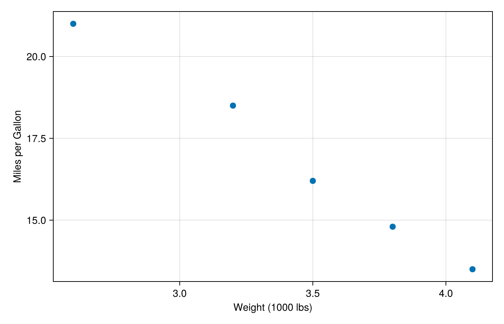

```{r}
#| label: setup
#| include: false

# Load JuliaCall and initialize Julia
library(JuliaCall)
options(JULIA_HOME = "/Users/mattwilliamson/.juliaup/bin")
julia_setup()
julia_command('using Pkg; Pkg.activate("/Users/mattwilliamson/Websites/spaseslab_website/julia-env")')
# Load R packages
library(ggplot2)
source("~/Websites/spaseslab_website/R/spases_palette.R")  
```

## What!? Whyyyyyyyyyy????

I'm a quantitative geographer that uses Bayesian statistics and computational models to understand the emergence and effectiveness of environmental institutions. Although I write code daily for my work, I am **definitely not** a computer scientist. Most of what I know about `R` and `Stan`, I've learned by teaching myself, reading helpful vignettes online, or begging for help on various discourse forums and Github issue pages. I've gotten passable enough at using `R` for spatial analyses that they even let me teach a [course](https://isdrfall25.classes.spaseslab.com/) on it^[I do not teach any courses in `Stan`, but I use it a lot for [my research](https://scholar.google.com/citations?user=SfbubrAAAAAJ&hl=en&oi=ao)]. So, why am I forcing myself to learn Julia.

I first met `julia` through some projects using [Circuitscape]() and [Omniscape]() to analyze wildlife connectivity and was amazed by how fast it could solve high resolution, broad extent problems. I didn't really have to understand `julia` to run those analyses (thanks to excellent packages and maintainers) and so the speed was basically free. I'm not working on a number of agent-based modeling projects that require fairly detailed spatial grids along with a lot of different agent decisions. Although there are a few ABM options in `R`, I have never really been able to get them to work the way I'd like. I discovered `Agents.jl` and thought "Whelp, I guess now I have to learn `julia`".

## The R approach

```{r}
#| label: fig-r-example
#| fig-cap: "Example plot using the SPASES palette in R"

ggplot(mtcars, aes(x = wt, y = mpg, color = factor(cyl))) +
  geom_point(size = 3) +
  scale_color_spases() +
  labs(
    x = "Weight (1000 lbs)",
    y = "Miles per Gallon",
    color = "Cylinders"
  ) +
  theme_minimal()
```

## The Julia approach

```{julia}
#| label: fig-julia-example
#| fig-cap: "Equivalent plot in Julia"
#| output: false

using CairoMakie

fig = Figure(size = (700, 450))
ax = Axis(fig[1, 1],
    xlabel = "Weight (1000 lbs)",
    ylabel = "Miles per Gallon"
)

x = [2.6, 3.2, 3.5, 3.8, 4.1]
y = [21.0, 18.5, 16.2, 14.8, 13.5]
scatter!(ax, x, y, markersize = 12)

save("julia-example.png", fig, px_per_unit = 2)
```



## Comparison

Wrap up what's similar, what's different, and when you might prefer
one approach over the other.

## Session info

```{r}
#| label: session-info
#| code-fold: true

sessionInfo()
```
