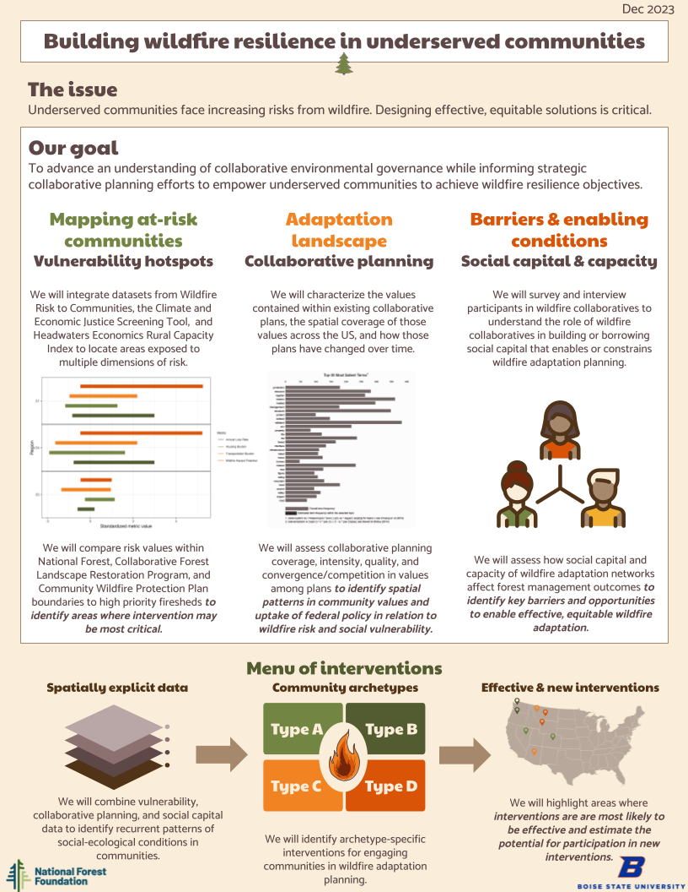

Collaboration has been offered as one of the only pathways to managing the cross-boundary nature of wildfire and building wildfire resilience at scale. By bringing diverse stakeholders together, forest managers can either leverage existing social capital to expedite necessary work or build social capital towards common wildfire goals. Yet collaborative efforts to build wildfire resilience may be socially stratified and opportunistic, privileging specific demographics and locations above others. As such, efforts to build wildfire resilience are misaligned with both social and ecological risk factors. Without attention to building equitable processes and strategically engaging with underserved communities, collaboration may exacerbate these disparities. In this project, we ask what are the key barriers and enabling conditions of effective, equitable collaboration towards wildfire resilience? In partnership with the National Forest Foundation, University of California Irvine, and Ohio State University, we are identifying areas where intervention may be most critical; mapping national collaborative planning coverage, quality, and diversity; and identifying different forms of social capital and capacity for collaboration. Using spatial analyses, natural language processing, network analysis, and multivariate approaches, our goal is to advance an understanding of collaborative environmental governance while informing strategic collaborative planning efforts by the National Forest Foundation and its partners to empower underserved communities to achieve wildfire resilience objectives.
