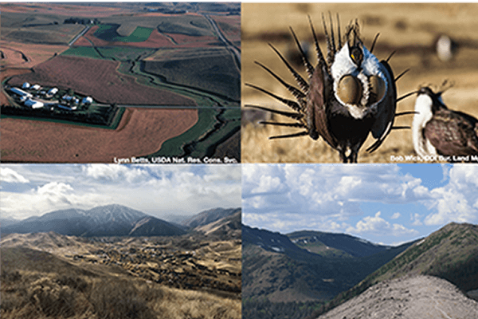

Conservation is both an outcome (preventing species extinction or the loss of ecosystem function) and action that society takes to achieve those outcomes. Years of conservation planning research has been devoted to trying to ensure that we take action in the places the 'need it most'. Despite the fact that individuals, organizations, and nation-states continue to devote resources to conservation (the action), many species and ecosystems remain at-risk (the outcome). We combine datasets describing people, politics, economics, institutions, and the environment with Bayesian spatial models to try and understand the enabling conditions that promote conservation as an action and how their alignment (or not) with ecological priorities affects outcomes for nature and people.

