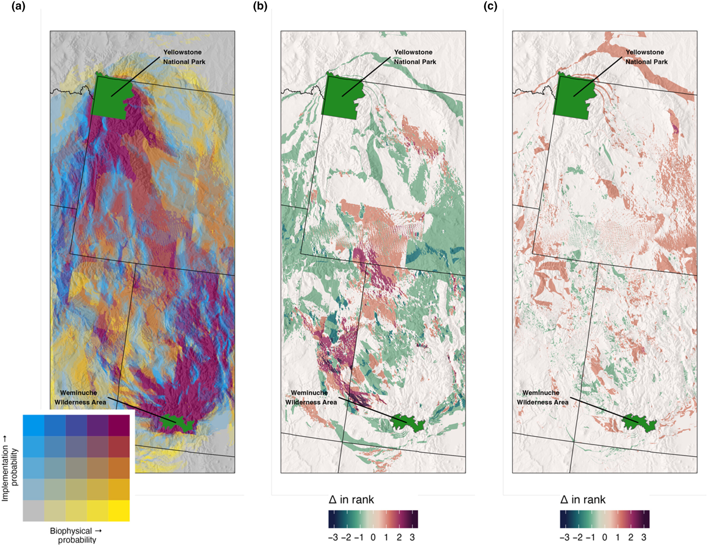

Conserving species' ability to traverse the landscape is vital for maintaining biodiversity in the face of global change. Connectivity conservation requires identifying important pathways for species' movements and aligning societal support for conservation of those pathways. Contemporary connectivity analyses emphasize the impacts of topography, vegetation and human footprint on species' movements; but largely ignore the role that attitudes, economics and institutions play in practitioners' ability to conserve those movements. Implementation resistance is analogous to biophysical resistance that combines social, economic and institutional factors that promote or impede connectivity conservation. We demonstrate the utility of integrating implementation resistance as a means of choosing between competing connectivity conservation strategies using wolves in Colorado (USA) as a case study. Our analysis of five potential corridor locations based on biophysical costs revealed substantial differences in the social costs associated with implementing each corridor despite relatively minimal differences in the biophysical costs. Our results highlight the need to design conservation interventions that fit both the social and ecological landscape and provide a framework for developing robust, interdisciplinary methods that facilitate implementable connectivity conservation.

